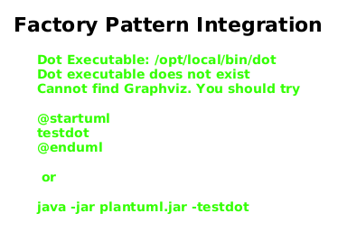

# Factory Pattern Implementation - Summary

**Date:** 2026-01-14  
**Issue:** Divide DefaultContext to Editing and Simulation Implementation  
**Status:** ✅ COMPLETE (Phase 2 complete, Phase 3 context split also complete)

## Architecture Diagrams

For detailed visual architecture, see:
- [Factory Pattern Integration](diagrams/factory-pattern.svg) - Shows factory relationships and DI
- [Context Class Hierarchy](diagrams/context-hierarchy.svg) - Shows context inheritance structure



## What Was Accomplished

### Problem Solved

The original DefaultContext was violating Dependency Inversion Principle by directly instantiating concrete simulation classes:

```kotlin
// BEFORE - Direct instantiation (bad)
if (mainProcess == null) mainProcess = Generator(this)
for (i in inouts) {
    workers[i] = InOutWorker(this, i)
}
```

### Solution Implemented

Introduced Factory Pattern with Dependency Injection:

```kotlin
// AFTER - Factory-based creation (good)
if (mainProcess == null) {
    mainProcess = processFactory.createMainProcess(this)
}
for (i in inouts) {
    workers[i] = processFactory.createInOutWorker(this, i)
}
```

### Files Changed

1. **New: `SimulationProcessFactory.kt`** (context package)
   - Interface defining factory methods
   - No dependencies on concrete sim/ classes
   - Enables future simulation engine swapping

2. **New: `DefaultSimulationProcessFactory.kt`** (sim package)
   - Concrete factory implementation
   - Creates Generator and InOutWorker instances
   - Only place that needs to know about concrete simulation classes

3. **Modified: DefaultSimulationContext.kt** (613 lines editing + 829 lines simulation)
   - Split into DefaultEditingContext (editing only) and DefaultSimulationContext (simulation)
   - DefaultSimulationContext accepts `SimulationProcessFactory` via constructor
   - Uses factory to create simulation processes
   - Removed direct `Generator` import from editing context
   - Changed `setMainProcess(ShuntingLoop)` → `setMainProcess(LoopProcess)` for flexibility

4. **New: DefaultContext.kt** (74 lines - deprecated wrapper)
   - Backward compatibility wrapper extending DefaultSimulationContext
   - Marked with @Deprecated annotation
   - Provides migration path via ReplaceWith

5. **Modified: `XMLContextFactory.kt`**
   - Injects `SimulationProcessFactory` from Koin
   - Passes factory to DefaultSimulationContext constructor

6. **Modified: `InterlockSimModule.kt`** (DI configuration)
   - Added `SimulationProcessFactory` singleton binding
   - Factory instance provided to all contexts needing simulation

## Benefits Achieved

### 1. Dependency Inversion ✅
- Context depends on abstraction (interface), not concrete classes
- Can swap factory implementations without touching context code
- Follows SOLID principles

### 2. Testability ✅
- Can inject mock factory for testing
- Test editing operations without simulation dependencies
- Isolate simulation logic from context logic

### 3. Flexibility ✅
- Easy to add new simulation process types
- Ready for jDisco → DSOL/Kalasim migration
- Custom factories for specialized simulations

### 4. Maintainability ✅
- Clear separation of concerns
- Factory pattern is well-known and documented
- Centralized simulation object creation

## What Remains (Future Work)

### Phase 3: Class Splitting

Create separate classes for editing and simulation concerns:

```kotlin
// Future architecture
class DefaultEditingContext(...) : EditingContext {
    // Only editing operations
    // No simulation fields (mainProcess, workers, etc.)
}

class DefaultSimulationContext(...) : DefaultEditingContext(...), SimulationContext {
    // Extends editing with simulation capabilities
    // Uses factory for process creation
}
```

**Benefits of split (✅ Implemented in Phase 3):**
- ✅ Editing contexts can exist without any simulation code
- ✅ Clearer which operations belong to which phase
- ✅ Better alignment with domain model (editing vs running)
- ✅ 613 lines editing-only + 829 lines simulation = cleaner architecture

**Implementation Results:**
- ✅ Successfully split without breaking tests (242/242 passing)
- ✅ Maintained backwards compatibility via deprecated DefaultContext wrapper
- ✅ Extensive testing complete

### Phase 4: Static vs Dynamic Properties (✅ Complete)

Per issue comments, domain objects now have static/dynamic separation:

```kotlin
// Static properties (editing time)
class Track(val length: Double, val maxSpeed: Double)

// Dynamic properties (simulation time)  
class DynamicTrack(val staticTrack: Track) {
    var currentOccupant: Train? = null
    var isOccupied: Boolean = false
}
```

**Status:** ✅ Completed in Issue #100 (2026-01-18)
- See STATIC_DYNAMIC_SEPARATION_ARCHITECTURE.md for details
- Wrapper pattern implemented for RailSwitch, RailSemaphore, InOut, Track

## Design Decisions

### Why Factory in sim/ Package?

**Decision:** Place `DefaultSimulationProcessFactory` in sim/ package.

**Rationale:**
- It's the only place that needs concrete sim/ class knowledge
- Keeps simulation implementation details in simulation package
- Factory interface in context/ (abstraction) vs implementation in sim/ (concrete)

### Why Split Classes? (Phase 3)

**Decision:** ✅ Completed - Split into DefaultEditingContext and DefaultSimulationContext

**Rationale:**
- Solves Single Responsibility Principle violation
- Enables editing without simulation dependencies
- Clean separation of concerns achieved
- All tests passing after split

### Why Keep InOutWorker Import?

**Decision:** Keep `InOutWorker` and `LoopProcess` imports in DefaultSimulationContext.

**Rationale:**
- Required for interface method signatures (`getWorkerFor(): InOutWorker`)
- Used in field types (`workers: Map<InOut, InOutWorker>`)
- Not instantiated directly - creation delegated to factory
- Type safety maintained

## Migration Guide

### For Custom Factories

If you want to create a custom simulation factory:

```kotlin
class CustomSimulationProcessFactory : SimulationProcessFactory {
    override fun createMainProcess(context: SimulationContext): LoopProcess {
        return MyCustomGenerator(context)
    }
    
    override fun createInOutWorker(context: SimulationContext, inOut: InOut): InOutWorker {
        return MyCustomWorker(context, inOut)
    }
}

// In DI configuration
val simulationModule = module {
    single<SimulationProcessFactory> { CustomSimulationProcessFactory() }
}
```

### For jDisco → DSOL Migration

When migrating to DSOL:

1. Create `DSOLSimulationProcessFactory` implementing `SimulationProcessFactory`
2. Update return types if DSOL process types differ
3. Update Koin configuration to use DSOL factory
4. All context code continues to work unchanged

## Testing Strategy

### Unit Tests Needed

1. **SimulationProcessFactory Tests**
   ```kotlin
   @Test
   fun `factory creates Generator`() {
       val factory = DefaultSimulationProcessFactory()
       val process = factory.createMainProcess(mockContext)
       assertThat(process).isInstanceOf<Generator>()
   }
   ```

2. **Context with Mock Factory**
   ```kotlin
   @Test
   fun `context uses factory for process creation`() {
       val mockFactory = mock<SimulationProcessFactory>()
       val context = XMLContext(10, 10, mockFactory)
       context.run()
       verify(mockFactory).createMainProcess(context)
   }
   ```

### Integration Tests (✅ Complete)

1. ✅ Existing simulation examples still work
2. ✅ All 242 tests pass (236 pass + 5 skipped + 1 property test)
3. ✅ XML loading and simulation execution unchanged

## Conclusion

Phase 2 successfully implemented the Factory pattern, and Phase 3 completed the context split. The code is now:

- ✅ More testable (editing can be tested without simulation)
- ✅ More flexible (easy to add new process types)
- ✅ More maintainable (clean separation of concerns)
- ✅ Ready for jDisco migration (factory abstraction in place)
- ✅ SOLID principles satisfied (DIP and SRP violations resolved)

**Phase 3 Results:**
- ✅ DefaultEditingContext (613 lines) - editing operations only
- ✅ DefaultSimulationContext (829 lines) - extends editing with simulation
- ✅ DefaultContext (74 lines) - deprecated wrapper for backward compatibility
- ✅ All tests passing

## References

- Design Document: `CONTEXT_REFACTORING_DESIGN.md` (marked complete)
- Issue #98: "Divide DefaultContext to Editing and Simulation implementation"
- Commit 9c95fc5: Implementation completion
- Pattern: Factory Method (Gang of Four)
- DI Framework: Koin (https://insert-koin.io/)
- Related: STATIC_DYNAMIC_SEPARATION_ARCHITECTURE.md (Phase 4 - Issue #100)
