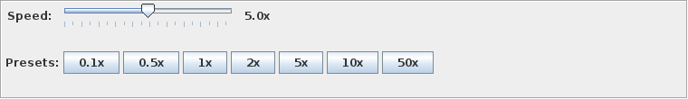

# Simulation Speed Control

Goal 7 adds live wall-clock speed control to the animated simulation GUI.

The control changes how fast events are presented to the user. It does **not** change simulation semantics, event ordering, or physics calculations.

## Overview

Use speed control when you want to:

- slow the model down for teaching or demos
- run near real time while watching train movement
- fast-forward through long scenarios
- pause temporarily while preparing for deeper Goal 8 debugging workflows

Supported range:

- **0.1x** minimum speed
- **50x** highest one-click preset
- **100x** absolute runner limit

## Quick Start

Start the animated GUI:

```bash
./gradlew runExampleGui
```

Or run the JAR directly after building:

```bash
java -jar build/libs/interlockSim.jar exampleGui shuntingLoop 300
```

For your own XML file, open the desktop UI and use **Simulation → Start...**.

When simulation mode is active, the GUI shows:

- the animated control panel (`Time`, `Status`, `Stop`)
- the speed control panel (`Speed` slider, presets, live speed label)
- the status bar speed indicator when speed is not `1.0x`

## GUI Controls

### Speed slider

- Range: **0.1x to 10.0x**
- Step: **0.1x**
- Best for fine adjustment while the simulation is already running

### Preset buttons

The panel and **Simulation → Speed** menu provide these presets:

- `0.1x`
- `0.5x`
- `1x`
- `2x`
- `5x`
- `10x`
- `50x`

`50x` is intentionally above the slider range. The slider stays clamped at its maximum visual position while the runner continues at `50x`.

### Status indicator

The status bar shows `Speed: X.Xx` whenever the current speed differs from `1.0x`. At the default speed the indicator is hidden to keep the bar uncluttered.




## Keyboard Shortcuts

Shortcuts are active in **simulation mode** while the application window has focus.

| Shortcut | Action |
| --- | --- |
| `1` | Set speed to `0.5x` |
| `2` | Set speed to `1x` |
| `3` | Set speed to `2x` |
| `4` | Set speed to `5x` |
| `5` | Set speed to `10x` |
| `+` | Increase speed by `×1.5` |
| `-` | Decrease speed by `÷1.5` |
| `Space` | Pause or resume the active simulation |

Notes:

- On many keyboards, `+` requires **Shift+`=`**.
- Numpad `+` and `-` are also supported.
- `Space` is the current Goal 8 integration point: it toggles the runner pause flag directly.

## Common Use Cases

- **Educational demo:** start at `0.5x` or `1x`, then drop to `0.1x` before a switch or semaphore change.
- **Normal observation:** keep the model at `1x` or `2x` and watch the event timeline.
- **Long scenario review:** jump to `10x` or `50x` to move through uneventful periods quickly.
- **Pre-debug pause workflow:** press `Space`, inspect the current state, then resume.

## Technical Details

- Speed control is implemented by `SimulationRunner`.
- The runner wraps `SimulationContext.run()` on a dedicated simulation thread.
- Wall-clock throttling uses `sleep(simDelta / speedMultiplier)`.
- `SimulationController` owns lifecycle, remembers the desired speed, and reapplies it on the next run.
- Swing updates stay on the EDT; simulation execution stays off the EDT.
- Pause blocks the simulation thread without advancing simulation time.

## Limitations

- The slider stops at **10x** even though the runner supports up to **100x**.
- `50x` is available from presets and the menu.
- To reach values above that, press `+` repeatedly from `50x` until the runner reaches its `100x` cap, or set the multiplier programmatically.
- Speeds above roughly **10x** are useful for throughput, but animation becomes progressively harder to follow visually.
- At **50x** and especially **100x**, small simulation deltas often round down to **0 ms sleep**, so execution becomes effectively CPU-bound.
- In CPU-bound ranges, expect higher processor usage and less visually smooth animation than at `1x`.
- Console-mode runs do not expose the GUI speed controls.

## Troubleshooting

- **I cannot see the controls:** make sure you started the animated GUI, not the console example.
- **The speed indicator disappeared:** that is expected at `1.0x`.
- **`Space` does nothing:** a simulation must be running and the frame must have keyboard focus.
- **The simulation feels too fast to follow:** use a preset such as `1x`, `0.5x`, or `0.1x`.
- **CPU usage is high at very high speeds:** reduce speed to re-enable more wall-clock throttling.
