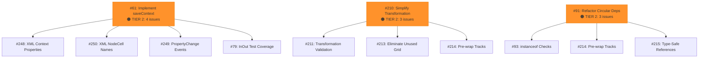

# Backlog Dependency Graph

**Visual representation of how Backlog issues (Set B) help other open issues (Set X)**

---

## High-Level Overview

```
                    ┌──────────────────────────────────────┐
                    │      Backlog Issues (30)             │
                    │                                      │
                    │  TIER 1: #94 ──────────────────────┐ │
                    │  TIER 2: #61, #210, #91 ──────────┐│ │
                    │  TIER 3: 8 issues ────────────────┐││ │
                    │  TIER 4: 18 issues (standalone)   │││ │
                    └───────────┬──────────────────────┬┼┼┼─┘
                                │                      │││
                                ▼                      │││
                    ┌──────────────────────┐           │││
                    │  Helps 56 Open Issues│           │││
                    └──────────────────────┘           │││
                                                        │││
            ┌───────────────────────────────────────────┘││
            │           ┌───────────────────────────────┘│
            │           │       ┌────────────────────────┘
            ▼           ▼       ▼
    ┌─────────┐  ┌──────────┐  ┌────────────┐
    │ Goal 7  │  │ XML Save │  │  Context   │
    │ (14)    │  │  (4)     │  │Transform(3)│
    └─────────┘  └──────────┘  └────────────┘
```

---

## Detailed Dependency Map

### TIER 1: Critical Path

```mermaid
graph TD
    B94[#94: Decouple Simulation<br/>🔥 TIER 1: 18 issues]

    B94 --> G7[Goal 7 Milestone<br/>#187-#200<br/>14 issues]
    B94 --> I190[#190: Remove System.exit]
    B94 --> I188[#188: SimulationRunner]
    B94 --> I215[#215: Type-Safe References]
    B94 --> I214[#214: Pre-wrap Tracks]

    G7 --> G187[#187: Simulation Speed Control]
    G7 --> G188[#188: Phase 1.1 Core Runner]
    G7 --> G189[#189: Phase 1.2 Main/Frame]
    G7 --> G190[#190: Phase 1.3 System.exit]
    G7 --> G191[#191: Phase 2.1 Control Panel]
    G7 --> G192[#192: Phase 2.2 ToolBar/Status]
    G7 --> G193[#193: Phase 2.3 MenuBar]
    G7 --> G194[#194: Phase 3.1 Keyboard]
    G7 --> G195[#195: Phase 4.1 Golden Output]
    G7 --> G196[#196: Phase 4.2 Performance]
    G7 --> G197[#197: Phase 4.3 Integration]
    G7 --> G198[#198: Phase 4.4 Regression]
    G7 --> G199[#199: Phase 5.1 User Docs]
    G7 --> G200[#200: Phase 5.2 Goals Correction]

    style B94 fill:#ff6b6b,stroke:#c92a2a,stroke-width:3px
    style G7 fill:#ffd43b,stroke:#fab005,stroke-width:2px
```



### TIER 2: Medium Impact Issues



### TIER 3: Low Impact Issues

```mermaid
graph TD
    B216[#216: JMH Benchmarks<br/>🟡 TIER 3: 2 issues]
    B247[#247: Fix Disabled Tests<br/>🟡 TIER 3: 2 issues]
    B79[#79: InOut Test Coverage<br/>🟡 TIER 3: 2 issues]
    B212[#212: Phase 6 Docs<br/>🟡 TIER 3: 2 issues]
    B214[#214: Pre-wrap Tracks<br/>🟡 TIER 3: 2 issues]
    B218[#218: Koin Golden Output<br/>🟡 TIER 3: 1 issue]
    B62[#62: Bidirectional Trains<br/>🟡 TIER 3: 1 issue]

    B216 --> I219[#219: Koin Perf to JMH]
    B216 --> I196[#196: Phase 4.2 Benchmarks]

    B247 --> I232[#232: Integration Tests]
    B247 --> I197[#197: Phase 4.3 Integration]

    B79 --> I232B[#232: Integration Tests]
    B79 --> I197B[#197: Phase 4.3 Integration]

    B212 --> I199[#199: Phase 5.1 User Docs]
    B212 --> I200[#200: Phase 5.2 Goals Correction]

    B214 --> I215[#215: Type-Safe References]
    B214 --> I213[#213: Eliminate Unused Grid]

    B218 --> I195[#195: Phase 4.1 Golden Output]

    B62 --> ANIM[AnimatedSim Milestone<br/>#201-#208]

    style B216 fill:#ffd43b,stroke:#fab005
    style B247 fill:#ffd43b,stroke:#fab005
    style B79 fill:#ffd43b,stroke:#fab005
    style B212 fill:#ffd43b,stroke:#fab005
    style B214 fill:#ffd43b,stroke:#fab005
    style B218 fill:#ffd43b,stroke:#fab005
    style B62 fill:#ffd43b,stroke:#fab005
```



---

## Dependency Chains (Execution Order)

### Chain 1: Simulation Architecture (CRITICAL)
```
#94 (Decouple simulation)
  └─> #190 (Remove System.exit)
      └─> #188 (SimulationRunner)
          └─> #187-#200 (Goal 7: 14 phases)
```

### Chain 2: Context System
```
#210 (Simplify transformation)
  ├─> #211 (Transformation validation)
  └─> #213 (Eliminate unused grid)

#214 (Pre-wrap tracks)
  └─> #215 (Type-safe references)
```

### Chain 3: XML Serialization
```
#61 (Implement saveContext)
  ├─> #248 (XML context properties)
  ├─> #250 (XML NodeCell names)
  ├─> #249 (PropertyChange events)
  └─> #79 (InOut test coverage)
```

### Chain 4: Testing Infrastructure
```
#216 (JMH benchmarks)
  └─> #219 (Koin perf to JMH)

#247 (Fix disabled tests)
  └─> #232 (Integration tests)
      └─> #197 (Phase 4.3: Integration)
```

### Chain 5: Circular Dependencies
```
#91 (Refactor circular deps)
  └─> #93 (instanceof checks in AbstractPath)
```

---

## Critical Path Analysis

### Shortest Path to 50% Progress

**Option 1: Direct Attack**
```
#94 (18 issues) → 32% complete
#61 (4 issues)  → 39% complete
#210 (3 issues) → 45% complete
#91 (3 issues)  → 50% complete

Total: 4 issues → 28 issues unblocked
Time: ~10-13 days
```

**Option 2: Quick Wins First**
```
#216 (2 issues)  → 4% complete
#79 (2 issues)   → 7% complete
#212 (2 issues)  → 11% complete
#214 (2 issues)  → 14% complete
#218 (1 issue)   → 16% complete
#247 (2 issues)  → 20% complete
--- then ---
#94 (18 issues)  → 52% complete

Total: 7 issues → 29 issues unblocked
Time: ~8-11 days (but #94 delayed)
```

---

## Bottleneck Analysis

### Issue #94 is a SUPERBOTTLENECK
- Blocks 32% of all open work
- Blocks entire Goal 7 milestone (14 issues)
- No dependencies (can start immediately)
- Medium-high complexity (sim/ restrictions)

**Risk:** If #94 gets blocked/delayed, 18 issues remain blocked

**Mitigation:**
1. Assign most experienced developer to #94
2. Start #61 and #210 in parallel
3. Have contingency plan if #94 encounters blockers

---

## Parallel Work Opportunities

### Scenario A: 3 Developers
```
Developer 1: #94 (Simulation decoupling)     [2-3 days]
Developer 2: #61 (XML save)                  [2-3 days]
Developer 3: #210 (Context transformation)   [3-4 days]

Result: 25 issues unblocked in ~4 days (parallel)
```

### Scenario B: 5 Developers
```
Developer 1: #94 (Simulation decoupling)     [2-3 days]
Developer 2: #61 (XML save)                  [2-3 days]
Developer 3: #210 (Context transformation)   [3-4 days]
Developer 4: #216 + #247 (Testing)           [1-2 days]
Developer 5: #79 + #212 (Tests + Docs)       [2-3 days]

Result: 33 issues unblocked in ~4 days (parallel)
```

### Scenario C: 1 Developer (Sequential)
```
Week 1: #94 (18 issues)                      → 32% complete
Week 2: #61 (4 issues) + #210 (3 issues)     → 45% complete
Week 3: #91 (3 issues) + quick wins          → 60% complete

Result: More sustainable pace, clear priorities
```

---

## Impact Heatmap

```
ISSUE    │ EFFORT      │ IMPACT │ EFFICIENCY │ PRIORITY
─────────┼─────────────┼────────┼────────────┼──────────
#94      │ Medium-High │   18   │    ████    │   🔥🔥🔥
#61      │ Medium      │    4   │    ████    │   🔥🔥
#210     │ Medium      │    3   │    ███     │   🔥🔥
#91      │ High        │    3   │    ██      │   🔥
#216     │ Low         │    2   │    █████   │   ⭐⭐⭐
#247     │ Medium      │    2   │    ███     │   ⭐⭐
#79      │ Low         │    2   │    █████   │   ⭐⭐⭐
#212     │ Medium      │    2   │    ███     │   ⭐⭐
#214     │ Low         │    2   │    █████   │   ⭐⭐⭐
#218     │ Low         │    1   │    ████    │   ⭐⭐
#62      │ Medium      │    1   │    ██      │   ⭐

Efficiency = Impact / Effort
🔥 = High-impact architectural work
⭐ = High-efficiency quick wins
```

---

## Summary Statistics

| Metric | Value |
|--------|-------|
| Total Backlog Issues (B) | 30 |
| Total Open Issues (X) | 56 |
| Issues with Dependencies | 12 (40%) |
| Standalone Issues | 18 (60%) |
| Total Helped Issues | 38 (68% of X) |
| Max Single Issue Impact | 18 (#94 = 32% of X) |
| Top 4 Issues Impact | 28 (50% of X) |
| Top 10 Issues Impact | 38 (68% of X) |

---

## Visual Impact Distribution

```
Issues Helped:
18 │ ████████████████████  #94
   │
 4 │ ███  #61
   │
 3 │ ██  #210, #91
   │
 2 │ █  #216, #247, #79, #212, #214
   │
 1 │ ▌  #218, #62
   │
 0 │ ▁▁▁▁▁▁▁▁▁▁▁▁▁▁▁▁▁▁  (18 standalone issues)
   └─────────────────────────────────────────────
     Backlog Issues (30 total)
```

---

## Recommended Actions

### Immediate (This Week)
1. **Assign #94** to experienced developer familiar with sim/ restrictions
2. **Start #216** as quick win (JMH benchmarks, 2-3 hours)
3. **Review #61** requirements with team (XML save planning)

### Short-term (Next 2 Weeks)
1. **Complete #94** (unblocks 18 issues, enables Goal 7)
2. **Complete #61** (enables XML save workflow)
3. **Complete #210** (improves context transformation)
4. **Start Goal 7** implementation phases

### Medium-term (Next Month)
1. **Complete #91** (refactor circular dependencies)
2. **Address Tier 3** issues (#216, #247, #79, #212, #214)
3. **Begin dependent issues** (#211, #213, #215)
4. **Continue Goal 7** phases

### Long-term (Next Quarter)
1. **Complete Goal 7** milestone (14 issues)
2. **Address Tier 4** standalone issues
3. **Re-evaluate backlog** based on new priorities

---

**Legend:**
- 🔥 High priority / High impact
- 🟠 Medium priority / Medium impact
- 🟡 Low priority / Low impact
- ⚪ Standalone / No dependencies
- ⭐ Quick win / High efficiency

**Last Updated:** 2026-01-21
